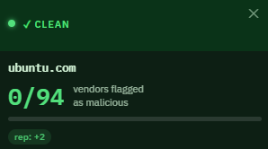
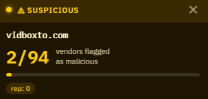
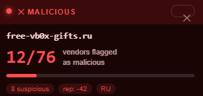

# 🛡️ Domain Reputation Check

**A Chrome extension that shows VirusTotal threat intelligence every time you visit a new domain.**

---

## What it does

Every time you navigate to a **new domain**, a sleek overlay appears in the top-right corner of your browser for **5 seconds**, showing you:

- ✅ **Verdict** — Clean, Suspicious, Malicious, or Unrated
- 🔢 **Score** — e.g. `12/76 vendors flagged as malicious`
- 📊 **Extra info** — reputation score, country, content categories
- ⏱️ **Auto-dismisses** after 5 seconds, or click ✕ to close early

The extension only checks each domain **once per tab session** — no spam, no slowdowns.

---

## Screenshots

| Clean | Suspicious | Malicious |
|-------|-----------|-----------|
|  |  |  |

---

## Installation

### Option A — Load unpacked (Developer Mode)

> No store account needed. Works immediately.

1. **Download** this repo — click `Code` → `Download ZIP` and unzip it
2. Open Chrome and go to `chrome://extensions/`
3. Enable **Developer mode** (toggle in the top-right corner)
4. Click **"Load unpacked"** and select the unzipped folder
5. The extension icon (🛡) will appear in your toolbar

### Option B — Microsoft Edge Add-ons Store

Chrome extensions work on Edge with zero changes. The Edge store is **free to publish** — no developer fee required.

---

## Setup — Get your VirusTotal API key

1. Go to [virustotal.com](https://www.virustotal.com) and create a free account
2. Click your profile → **API Key**
3. Click the 🛡 extension icon in Chrome → paste your key → **Save**

> **Free tier limits:** 4 lookups/minute · 500 lookups/day — plenty for personal use.
> 
> **Premium limits:** A LOT MORE lol.
---

## Permissions explained

| Permission | Why it's needed |
|---|---|
| `webNavigation` | Detect when the user navigates to a new domain |
| `storage` | Save your VirusTotal API key securely |
| `tabs` | Send messages between the service worker and the active tab |
| `host_permissions: <all_urls>` | Allow the content script to inject the overlay on any site |
| `https://www.virustotal.com/*` | Make API calls to VirusTotal |

No browsing history is stored. No data is sent anywhere except VirusTotal's public API.

---

## Privacy

- Your API key is stored locally in `chrome.storage.sync` (synced to your Google account, not shared with anyone else)
- Domain names are sent to VirusTotal's API to retrieve public threat data — the same data available on their website
- No analytics, no tracking, no ads

## Contributing

Pull requests are welcome! Some ideas for improvements:

- [ ] Add an options page with a whitelist/allowlist for trusted domains
- [ ] Cache recent results to reduce API calls
- [ ] Show results for IP addresses, not just hostnames
- [ ] Add support for other threat intel APIs (e.g. URLhaus, AbuseIPDB)
- [ ] Dark/light theme toggle for the overlay

---

## License

The MIT License (MIT)

Copyright (c) 2011-2026 The Bootstrap Authors

Permission is hereby granted, free of charge, to any person obtaining a copy
of this software and associated documentation files (the "Software"), to deal
in the Software without restriction, including without limitation the rights
to use, copy, modify, merge, publish, distribute, sublicense, and/or sell
copies of the Software, and to permit persons to whom the Software is
furnished to do so, subject to the following conditions:

The above copyright notice and this permission notice shall be included in
all copies or substantial portions of the Software.

THE SOFTWARE IS PROVIDED "AS IS", WITHOUT WARRANTY OF ANY KIND, EXPRESS OR
IMPLIED, INCLUDING BUT NOT LIMITED TO THE WARRANTIES OF MERCHANTABILITY,
FITNESS FOR A PARTICULAR PURPOSE AND NONINFRINGEMENT. IN NO EVENT SHALL THE
AUTHORS OR COPYRIGHT HOLDERS BE LIABLE FOR ANY CLAIM, DAMAGES OR OTHER
LIABILITY, WHETHER IN AN ACTION OF CONTRACT, TORT OR OTHERWISE, ARISING FROM,
OUT OF OR IN CONNECTION WITH THE SOFTWARE OR THE USE OR OTHER DEALINGS IN
THE SOFTWARE.

---

  Built with ❤️ using the <a href="https://developers.virustotal.com/reference/overview">VirusTotal Public API v3</a>

